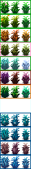

# Author Guide

This guide assumes you understand the basics of [Content Patcher](https://github.com/Pathoschild/StardewMods/blob/develop/ContentPatcher/docs/author-guide.md).

For quick examples check [the example content pack](../GrassVariety.Test).

## Data Model

To add your new grass variety, do `EditData` on `mushymato.GrassVariety/Data`.

```js
{
  "Action": "EditData",
  "Target": "mushymato.GrassVariety/Data",
  "Entries": {
    "{{ModId}}_YourGrassVariety": {
      // =============== //
      // Required Fields //
      // =============== //
      // Id must be same as key, if they are different the key is taken as truth.
      "Id": "{{ModId}}_YourGrassVariety",
      // The texture must be loaded (via Load or InternalAssetKey)
      "Texture": "{{ModId}}/YourGrassTexture",
      // Which grass kind this variety should apply to
      "ApplyTo": [
        "springGrass",
        // "caveGrass"
        // "frostGrass"
        // "lavaGrass"
        // "caveGrass2"
        // "cobweb"
        "blueGrass"
      ],
      // =============== //
      // Optional Fields //
      // =============== //
      // Relative weight of this variety when there are multiple varieties able apply to this grass.
      "Weight": 1,
      // Game State Query to determine if this variety should apply
      "Condition": null,
      // If this is true, exclude this variety from the standard pool
      // This grass will only appear via the game location/location context mushymato.GrassVariety_AllowedVarietyPrefix custom field, or via a custom grass starter
      "ByLocationAllowanceOnly": false,
      // Number of days this grass will remain at a particular variaty before it is allowed to reroll to another variety
      // Special values:
      // -1 remains forever
      // 0 does not persist not even on the same day
      "PersistDays": 1,
      // The sub variants of this variety, if not specified the default is 0,1,2
      // This can also be written as "{{Range:0,3}}" or [0, 1, 2, 3]
      "SubVariants": "0,1,2,3",
      // Changes the color of the grass destroy animation
      "DestroyColors": {
        "springGrass": [
          "Black",
          "Red",
          "Yellow",
          "Blue"
        ],
        "blueGrass": [
          "White",
          "Green",
          "Yellow",
          "Blue"
        ],
      },
      // Item(s) to drop after this grass is cut by weapon or scythe
      // The tool item is passed as the Target item to the Condition
      "OnCutItemSpawns": [
        {
          // item spawn field with Condition, see https://stardewvalleywiki.com/Modding:Item_queries
          // Also accepts these extra fields
          // "SearchMode": one of "AllOfTypeItem", "FirstOfTypeItem", "RandomOfTypeItem", default "AllOfTypeItem"
          // "RequiresScythe": whether this drop only happens on scythe, default false
        }
      ],
      // List of tile actions to run after this grass is cut, these are same you put on Buildings layer Action tile property
      "OnCutTileActions": [
        // See https://stardewvalleywiki.com/Modding:Maps#Action
        "tile action string"
      ],
    },
  }
}
```

## Spritesheet Format

Grass Variety works by altering the grass's spritesheet and some state values when the grass becomes visible. Since draw logic is not changed, there are rules for how you may arrange your spritesheet.

**Width**: 15 * number of subvarietys (more on that later), minimum 45
**Height**: 240, or 20 * 12

### Grass Kind to Sprite Y Row

The row where you may put the grass is dependent on the kind. Even if you have a grass variety that is only supposed to apply on blue grass, you must put your grass on rows 8, 9, 10, 11 rather than simply at 0,0.

| Row | Grass Kind | Season |
| --- | ---------- | ------ |
| 0 (y=0) | springGrass | Spring |
| 1 (y=20) | springGrass | Summer |
| 2 (y=40) | springGrass | Fall |
| 3 (y=60) | caveGrass | Any |
| 4 (y=80) | springGrass / frostGrass | Winter / Any |
| 5 (y=100) | lavaGrass | Any |
| 6 (y=120) | caveGrass2 | Any |
| 7 (y=140) | cobweb | Any |
| 8 (y=160) | blueGrass | Spring |
| 9 (y=180) | blueGrass | Summer |
| 10 (y=200) | blueGrass | Fall |
| 11 (y=220) | blueGrass | Winter |



### Sub Variants

A single tile of grass is made of 4 different pieces of grass, and their sprites are randomly chosen from the row. In vanilla this is limited to the 3 textures, while Grass Variety allows each variety to determine which sprites from the row to use.

## Location Filters

You can make a location or location context by adding `"mushymato.GrassVariety_AllowedVarietyPrefix": "{{ModId}}_YourGrassVariety"` to CustomFields. This also works as a map property.

This is called a prefix because it allows all grass varieties whose id starts with `{{ModId}}_YourGrassVariety`.

If you had 3 varieties `{{ModId}}_YourGrassVarietyA`. `{{ModId}}_YourGrassVarietyB`, and `{{ModId}}_SomethingElse`:
- `{{ModId}}_YourGrassVarietyA` `{{ModId}}_YourGrassVarietyB` would be allowed by prefix
- `{{ModId}}_SomethingElse` would be banned by prefix

A grass variety can be excluded from the default pool by `"ByLocationAllowanceOnly": true`. This means the variety will not appear unless:
- It is a location that has an allowed variety prefix set, and it's Id begins with the allowed variety prefix.
- It is planted with a custom grass starter, which ignores standard logic when checking for allow.

## Custom Grass Starters

You can create a grass starter item that will plant the variety or varieties you specify.

Grass added by a custom starter that defines specific starter variety is consider "forced", which means that:
- It ignores the normal location and condition checks when planting
- It does still respect weight when picking variety for the first time
- It will never reroll into another grass variety

```js
{
  "Action": "EditData",
  "Target": "Data/Objects",
  "Entries": {
    "{{ModId}}_YourGrassStarter": {
      "Name": "{{ModId}}_YourGrassStarter",
      "DisplayName": "Your Grass Starter",
      "Description": "Your Grass Starter",
      "Type": "Crafting",
      "Category": 0,
      "Price": 50,
      "Texture": null,
      "SpriteIndex": 0,
      "CustomFields": {
        // Which kind of grass this starter will plant, required
        "mushymato.GrassVariety/GrassStarterKind": "blueGrass",
        // What variety prefix to use, optional
        "mushymato.GrassVariety/GrassStarterVariety": "{{ModId}}_YourGrassVariety",
        // Sound of grass planting, optional
        "mushymato.GrassVariety/GrassStarterPlacementSound": "dirtyHit"
      }
    }
  }
}
```
